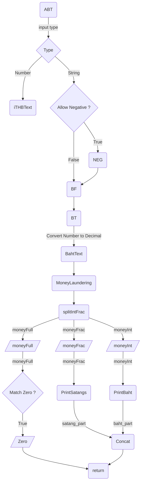

# [BahtRext](https://pinghuskar.github.io/npm-bahtrext/)


[](https://sonarcloud.io/summary/new_code?id=PingHuskar_npm-bahtrext)
[](https://sonarcloud.io/summary/new_code?id=PingHuskar_npm-bahtrext)
[](https://sonarcloud.io/summary/new_code?id=PingHuskar_npm-bahtrext)
[](https://sonarcloud.io/summary/new_code?id=PingHuskar_npm-bahtrext)
[](https://sonarcloud.io/summary/new_code?id=PingHuskar_npm-bahtrext)

[](https://sonarcloud.io/summary/new_code?id=PingHuskar_npm-bahtrext)
[](https://sonarcloud.io/summary/new_code?id=PingHuskar_npm-bahtrext)
[](https://sonarcloud.io/summary/new_code?id=PingHuskar_npm-bahtrext)
[](https://sonarcloud.io/summary/new_code?id=PingHuskar_npm-bahtrext)

## Install
### ES6
```
npm install bahtrext@2.5.0
```
### ES5
```
npm install bahtrext@1.7.2
```

## Demo / Example
- [Webpack (1.4.5)](https://webpack.js.org/)
  - [REPO](https://github.com/PingHuskar/webpack-bahtrext)
  - [DEMO](https://pinghuskar.github.io/webpack-bahtrext/)
  - [scripts](https://pinghuskar.github.io/webpack-bahtrext/main.js)
- React
  - [BahtGame](https://timely-fenglisu-b68fd6.netlify.app/)
  - [scroll-trigger](https://github.com/PingHuskar/bahtrext-scroll-trigger)

## Must Read
- **Checkout Test Cases in `index.test.js`**
- **`101`** ควรจะถูกอ่านอย่างไร ?
  - `หนึ่งร้อยหนึ่งบาทถ้วน`
    - [`Google Sheets`](https://sheets.google.com/)
    - `สัญญากู้เงินของธนาคาร`* ลองมากู้ได้เลยครับ ถ้าไม่ใช่บอกผมด้วย
    - [jojoee/bahttext](https://www.npmjs.com/package/bahttext)
    - จะอ่านว่า`เอ็ด`เมื่อหลักสิบมีค่า เช่น `สิบเอ็ด`, `ยี่สิบเอ็ด`
  - `หนึ่งร้อยเอ็ดบาทถ้วน`
    - [`MS Excel`](https://www.microsoft.com/th-th/microsoft-365/excel)
    - [`thai-baht-text`](https://www.npmjs.com/package/thai-baht-text)
    - [earthchie/BAHTTEXT.js](https://github.com/earthchie/BAHTTEXT.js)
  - `หนึ่งร้อยหนึ่งบาทถ้วน` หรือ `หนึ่งร้อยเอ็ดบาทถ้วน` ก็ได้ ให้เข้าใจได้ตรงกัน
    - [**`BahtRext`**](https://pinghuskar.github.io/npm-bahtrext/)
      - [Active Versions](https://www.npmjs.com/package/bahtrext?activeTab=versions)
      - [GitHub Repo](https://github.com/PingHuskar/npm-bahtrext)

## Beliefs
1. Money in Thai Baht can be translate to word
2. Default Decimal places is 2 digits; 3+ digits are optional.
3. Support Negative Number as Other Baht JS Library
4. All Synchronous function
5. This Number System not working well with large numbers. Is there a better way to read numbers in Thai?


## Test Regex
- [ValidSATANGRegex](https://regex101.com/r/yVvsFN/3)

## 😊 Plz Consider
- [Line Sticker](https://store.line.me/stickershop/product/28717665/en)
- [Give A Star](https://github.com/PingHuskar/npm-bahtrext)
- [ProductHunt](https://www.producthunt.com/products/bahtrext)
- Write a Review
- Submit Test Case(s)
- [GitHub Sponsors](https://github.com/sponsors/PingHuskar)

## Author
[Chadin Chaipornpisuth](https://chadindev.in.th/)

## Changes
- 2.4.0 - Clean Code?
- 2.3.4 - Infinity
- 2.2.0 - ES6 [1.7.2]
- 1.7.1 - apply `Rest Parameters` => add function `BulkReplace`, `applyReplacements`
- 1.7.0 - add class `BR`
- 1.6.2 - [Refact.ai] model gpt-4o-mini + human refactor
- 1.6.1 - allow literal separator (,)
- 1.6.0 - add Hexadecimal
- 1.5.0 - add Binary Literal
- 1.4.3 - 1.4.4 - Refactor
- 1.4.2 - add NEG
- 1.3.3 - Update Version Thai Baht Text JS + add SEP
- 1.2.1 - GoogleSheetsCellCharactersLimit
- 1.2.0 - Dynamic `เอ็ด`
- 1.1.7 - remove `Googolplex`
- 1.1.3 - add LNBT
- 1.1.1 
  - Fix TB validation
  - BF is main function
  - ABT for dynamic type
- 1.1.0 - TB Ready for Production?!
- 1.0.9 - add TB (reverse BT)
- 1.0.8 - add SatangNum
- 1.0.6 - BT is main function

## Flow
